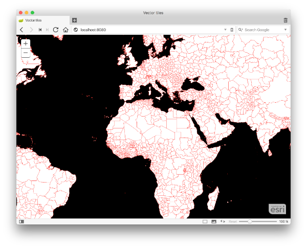

# Heuristic Experiment in Dynamic Vector Tile Generation for Web Maps



<sub>For the keen eyes, I'm using the new [Vivaldi](https://vivaldi.com/) web browser</sub>

This _experimental_ project is a visualizer of my [Vector Tile Encoder](https://github.com/mraad/vector-tiles) as it dynamically generates vector tiles for web applications based on the [Javascript API for ArcGIS](https://developers.arcgis.com/javascript/beta/).
Specifically, this visualizer mimics the response of a VectorTileServer REST request emitted by a [VectorTileLayer](https://developers.arcgis.com/javascript/beta/api-reference/esri-layers-VectorTileLayer.html) to dynamically search a data source and transform the result set into vector tile features.

The server application is based on [Spring Boot](https://spring.io/guides/gs/spring-boot/) and I highly recommend the [Spring Initializer](https://start.spring.io/) for a quickstart.

Fundamentally, the application consists of responding to 3 mapping requests:

- `/arcgis/rest/services/{datasource}/VectorTileServer` - This returns the vector tile metadata in [JSON](http://json.org/) for the specified `{datasource}` such as the full extent of the datasource, min/max scales for visibility and the resolution and scale at different level of details.    
- `/arcgis/rest/services/{datasource}/VectorTileServer/styles` - This returns the [Mapbox GL style](https://www.mapbox.com/mapbox-gl-style-spec/#) in [JSON](http://json.org/) that defines what data to draw, the order to draw it in, and how to style the data when drawing it. Note - Not all the styles are implemented in this project.
- `/arcgis/rest/services/{datasource}/VectorTileServer/tile/{z}/{x}/{y}.pbf` - This returns an array of bytes consisting of the [Protocol Buffer](https://developers.google.com/protocol-buffers/) encoding of a tile based on the [Vector Tile Specification](https://github.com/mapbox/vector-tile-spec) for a specified `datasource` at a specifed level `z` and specified horizonal `x` and vertical `y` placements. 

## In Action

The easiest and most reliable way to reduplicate the visualization process in action is to use [Docker](https://www.docker.com/).
 
- Start a [machine](https://docs.docker.com/machine/) named `dev` using the [VirtualBox](https://docs.docker.com/machine/get-started/) driver
```
docker-machine create --driver virtualbox --virtualbox-memory "1024" --virtualbox-cpu-count "1" dev
```

- Get the machine's IP
```
docker-machine ip dev
```

- Setup the docker environment variables
```
eval $(docker-machine env dev)
```

- Run the Vector Tile Server
```
docker run -it --rm -p 8080:8080 mraad/vector-tiles-boot
```

- Open a browser and navigate to `http://IP-FROM-ABOVE:8080`
- Shutdown the server by navigating to `http://IP-FROM-ABOVE:8080/shutdown.html`

## The Data Source

As of Apr 8, this implementation relies on a static data source. Later project updates will have a dynamic data source.
The static data source is a GZip text file containing the world administrative polygons in geographical coordinates.
Each line in the text file is a polygon feature with a set of tab separated attributes and the geometry is in [WKT](https://en.wikipedia.org/wiki/Well-known_text) format. 

## Building the Project

```shell
mvn clean package
```

## Building The Docker Image

```shell
cd docker
cp ../target/vector-tiles-boot-0.0.1-SNAPSHOT.jar .
docker build\
 --force-rm=true\
 --ulimit nofile=65535:65535\
 --ulimit nproc=25059:25059\
 -t mraad/vector-tiles-boot .
```
  
## See Also

- <https://blogs.esri.com/esri/arcgis/2015/07/20/vector-tiles-preview/>
- <https://github.com/mapbox/tilejson-spec>
- <http://wiki.openstreetmap.org/wiki/Slippy_map_tilenames#Scala>
- <https://github.com/mapbox/awesome-vector-tiles>
- <https://www.mapbox.com/mapbox-gl-style-spec/>
- <http://www.diva-portal.org/smash/get/diva2:851452/FULLTEXT02>
- <https://github.com/mapbox/mercantile>
- <https://github.com/opensciencemap/vtm>
- <https://docs.spring.io/spring-boot/docs/current/reference/html/deployment-install.html>
- <https://hub.docker.com/r/gliderlabs/alpine/>
- <https://developer.atlassian.com/blog/2015/08/minimal-java-docker-containers/>
- <https://github.com/anapsix/docker-alpine-java>

## License

[Apache License, version 2.0](http://www.apache.org/licenses/LICENSE-2.0)
